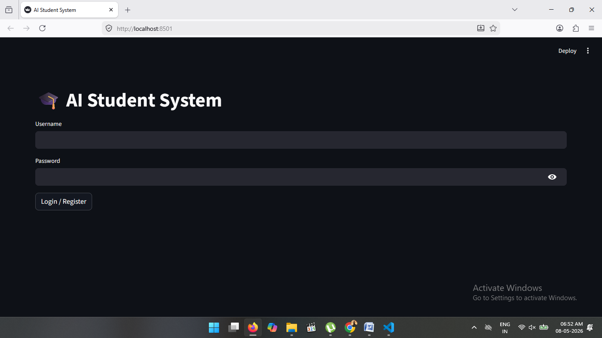
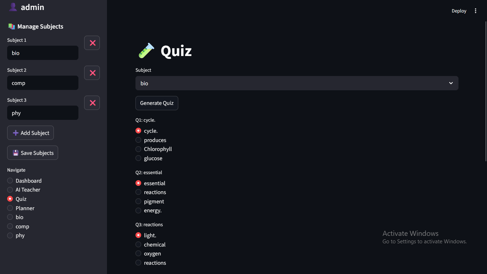
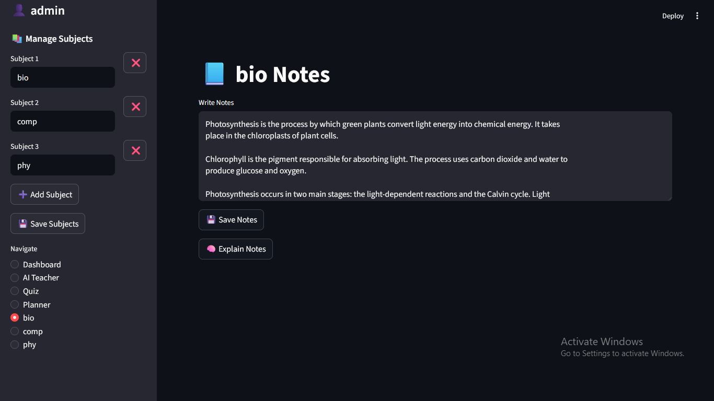
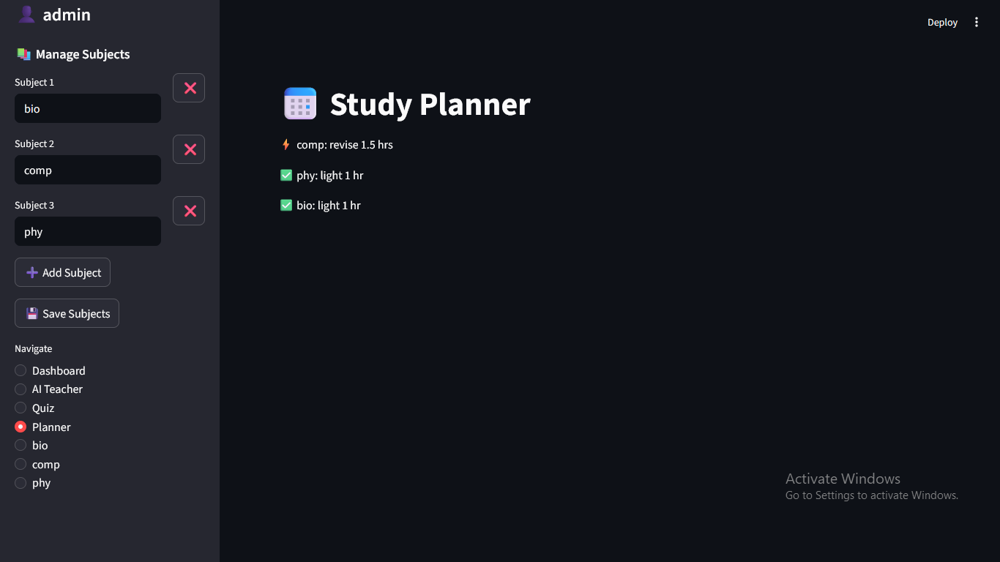
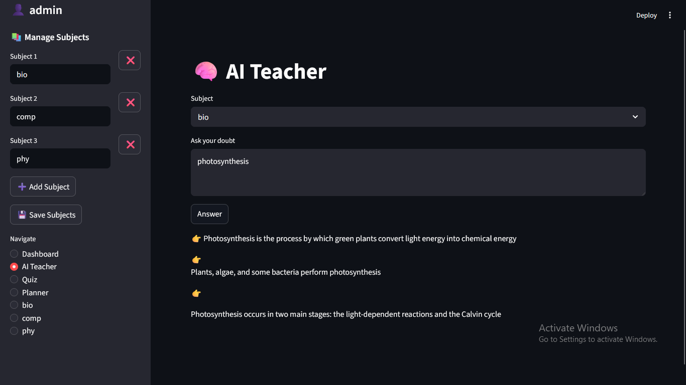

## Student Support System

Student System is an intelligent educational platform developed using Python, Streamlit, and SQLite. It helps students manage subjects, save notes, track performance using graphs and pie charts, generate MCQ quizzes, and create smart study plans with offline AI-based note explanation features.

# Screenshots

## Dashboard
.png)
.png)

## Login

## Quiz

## Notes 

## Planner 

## Teacher
